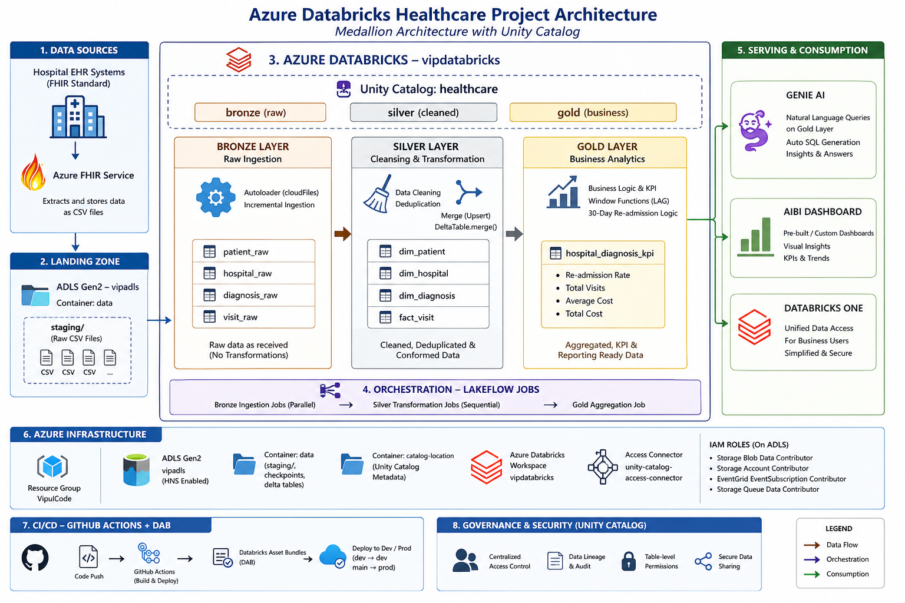
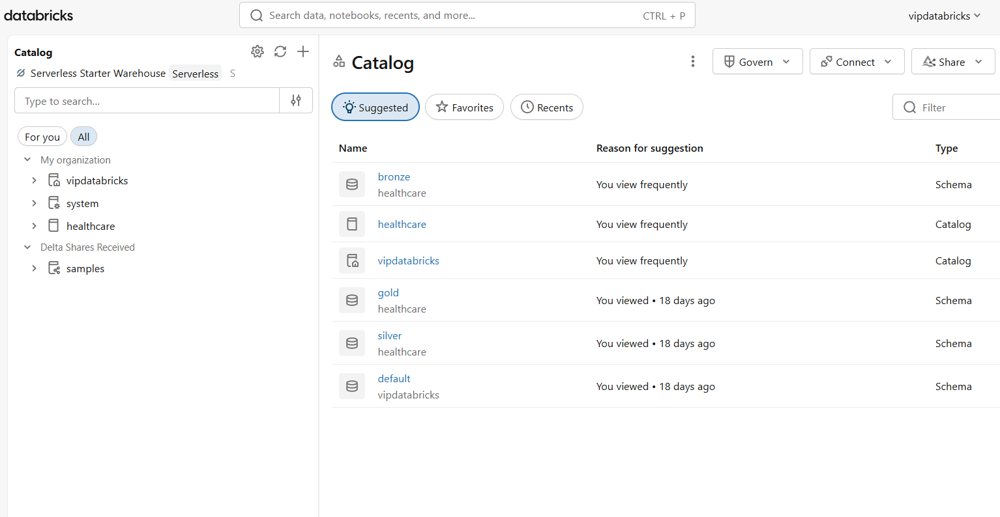
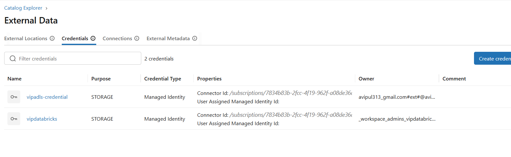
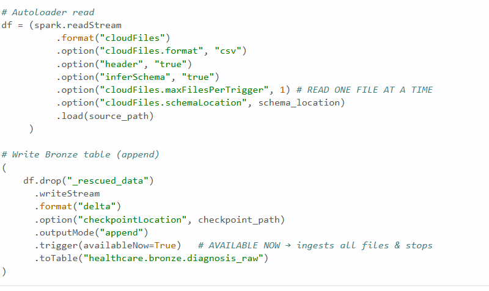
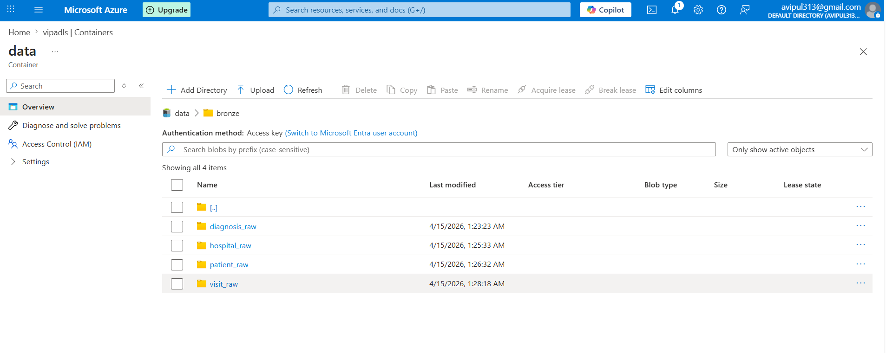
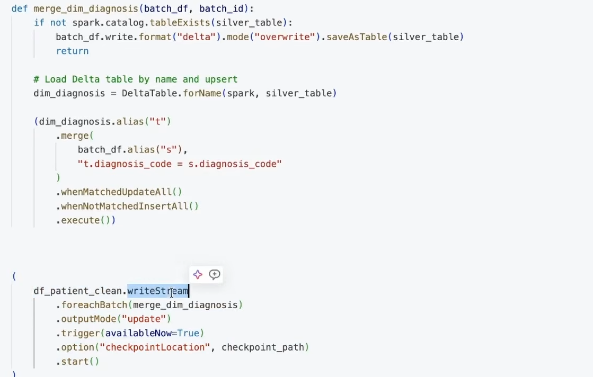
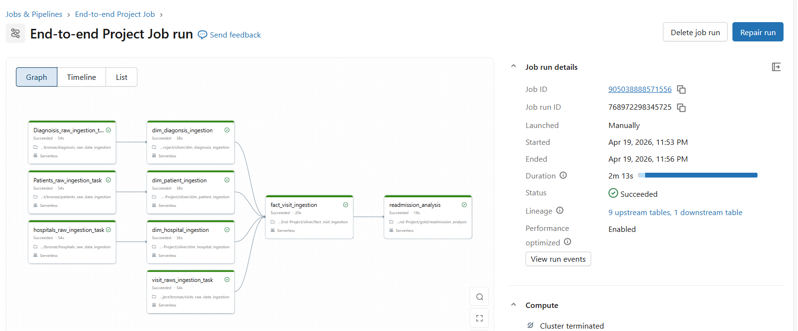
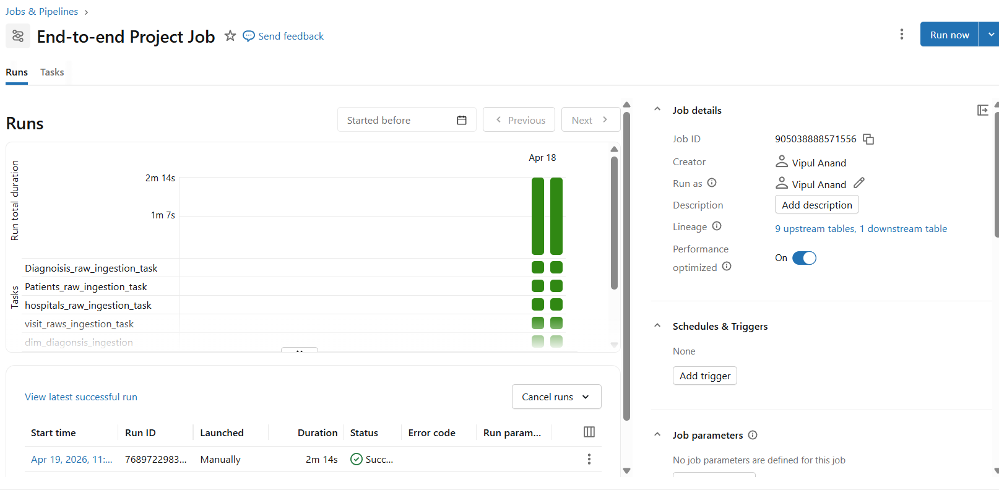
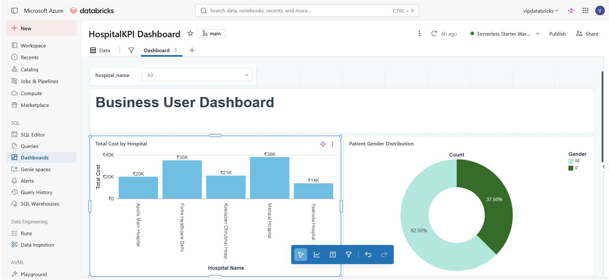
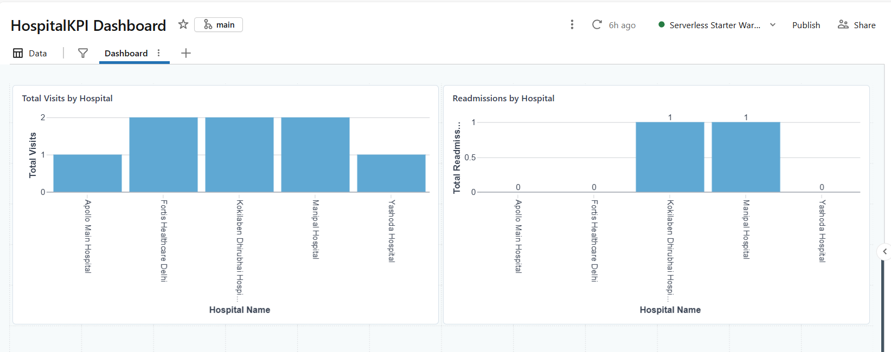

# 🏥 Azure Databricks Healthcare Data Engineering Project

> End-to-end real-world data engineering pipeline built on **Azure Databricks** to analyze and reduce 30-day hospital patient re-admissions using **Medallion Architecture**, **Delta Lake**, **Unity Catalog**, and **CI/CD automation**.

---

## 📌 Table of Contents
- [Business Problem](#-business-problem)
- [Architecture](#-architecture)
- [Tech Stack](#-tech-stack)
- [Data Model](#-data-model-star-schema)
- [Unity Catalog Setup](#-unity-catalog-setup)
- [Bronze Layer](#-bronze-layer--raw-ingestion)
- [Silver Layer](#-silver-layer--transformation)
- [Gold Layer](#-gold-layer--business-analytics)
- [Orchestration](#-orchestration--lakeflow-jobs)
- [CI/CD Pipeline](#-cicd--github-actions--databricks-asset-bundles)
- [AI Analytics](#-ai-analytics--genie)
- [Dashboard](#-dashboard--aibi)
- [Project Structure](#-project-structure)
- [How to Run](#-how-to-run)

---

## 🎯 Business Problem

**AEX Health Hospitals** — a multi-hospital network — was experiencing high **30-day patient re-admission rates**, causing:

- 💸 Financial losses from non-reimbursable re-admissions
- 🏥 Resource strain due to bed shortages
- 😟 Declining patient experience and trust

**Business Goals agreed with stakeholders:**
- Identify diseases and procedures driving re-admissions
- Compare performance across hospital branches, doctors, and departments
- Track patients re-admitted within 30 days with the same diagnosis
- Generate cost and KPI insights for leadership

---

## 🏗️ Architecture



The solution follows **Medallion Architecture** on Azure Databricks with ADLS Gen2 as the storage backbone:

```
EHR Systems (FHIR) → ADLS Gen2 (Raw CSV)
        ↓
    Bronze Layer  →  Raw Delta tables (Autoloader)
        ↓
    Silver Layer  →  Cleaned & merged dimension/fact tables
        ↓
     Gold Layer   →  Re-admission KPIs & aggregations
        ↓
  Genie AI + AIBI Dashboard  →  Business insights
```

---

## ⚙️ Tech Stack

| Category | Technology |
|---|---|
| Cloud Platform | Microsoft Azure |
| Data Processing | Azure Databricks, PySpark |
| Storage | ADLS Gen2 (Azure Data Lake Storage Gen2) |
| Table Format | Delta Lake |
| Governance | Unity Catalog |
| Ingestion | Databricks Autoloader (cloudFiles) |
| Orchestration | Databricks Lakeflow Jobs |
| CI/CD | GitHub Actions + Databricks Asset Bundles |
| AI Analytics | Databricks Genie |
| Visualization | Databricks AIBI Dashboard |

---

## 📊 Data Model (Star Schema)

Designed using **Kimball Dimensional Modeling**:

| Table | Layer | Description |
|---|---|---|
| `dim_patient` | Silver | Patient demographics and details |
| `dim_hospital` | Silver | Hospital info, city, bed count |
| `dim_diagnosis` | Silver | Diagnosis codes and descriptions |
| `fact_visit` | Silver | Patient visits with admission/discharge dates and costs |
| `hospital_diagnosis_kpi` | Gold | Re-admission rates, costs, KPIs by hospital & diagnosis |

**Grain:** One row per patient visit (daily)

---

## 🔐 Unity Catalog Setup

Unity Catalog provides centralized governance, access control, and metadata management across all data assets.



**Setup:**
- **Catalog:** `healthcare`
- **Schemas:** `bronze`, `silver`, `gold`
- **Storage Credential:** `vipadls-credential` (via Access Connector managed identity)
- **External Locations:** Registered ADLS paths for data access




**IAM Roles assigned to Access Connector on ADLS:**
- `Storage Blob Data Contributor`
- `Storage Account Contributor`
- `EventGrid EventSubscription Contributor`
- `Storage Queue Data Contributor`

---

## 📥 Bronze Layer — Raw Ingestion

Raw CSV files land in ADLS `staging/` folder and are ingested incrementally into Delta tables using **Databricks Autoloader**.





**Key design decisions:**
- `cloudFiles` format for incremental file detection
- `checkpointLocation` to track processed files — prevents duplicate ingestion
- `schemaLocation` for schema inference and evolution
- `trigger(availableNow=True)` — processes all current files then stops (batch-style streaming)
- `outputMode("append")` — raw data always appended, never overwritten

**Bronze Tables:**
```
healthcare.bronze.diagnosis_raw
healthcare.bronze.hospital_raw
healthcare.bronze.patient_raw
healthcare.bronze.visit_raw
```

---

## 🔄 Silver Layer — Transformation & Upsert

Reads **incrementally** from Bronze using `spark.readStream.table()` and performs deduplication and merge operations into dimension and fact tables.



**Key design decisions:**

| Decision | Reason |
|---|---|
| `spark.readStream` (not `spark.read`) | Checkpointing — only processes NEW Bronze records each run |
| `dropDuplicates([primary_key])` | Removes duplicates before writing to Silver |
| `DeltaTable.merge()` | Upsert — updates existing records, inserts new ones |
| `load_timestamp` | Audit trail for every Silver record |
| `foreachBatch()` | Applies merge function to each streaming micro-batch |

**Merge logic:**
```python
dim_table.alias("t")
  .merge(batch_df.alias("s"), "t.diagnosis_code = s.diagnosis_code")
  .whenMatchedUpdateAll()
  .whenNotMatchedInsertAll()
  .execute()
```

**Silver Tables:**
```
healthcare.silver.dim_diagnosis
healthcare.silver.dim_hospital
healthcare.silver.dim_patient
healthcare.silver.fact_visit
```

---

## 📈 Gold Layer — Business Analytics

Reads full Silver `fact_visit` table, applies **Spark window functions** to detect re-admissions, and aggregates KPIs by hospital and diagnosis.

**Re-admission Detection Logic:**
1. Partition by `patient_id`, order by `admission_date`
2. Use `lag()` to get previous admission date per patient
3. Calculate days between current and previous admission
4. Flag as re-admission if gap ≤ 30 days
5. Aggregate by hospital and diagnosis → KPI table

**Gold Table:**
```
healthcare.gold.hospital_diagnosis_kpi
```

**KPIs Generated:**
- Re-admission rate (%)
- Total visits per hospital
- Average cost per visit
- Total treatment cost
- Month-over-month trends

---

## 🔁 Orchestration — Lakeflow Jobs

All notebooks orchestrated into a single job with proper task dependencies:





**Job: End-to-end Healthcare Project Job**

```
Bronze Tasks (Parallel — no dependencies):
├── diagnosis_raw_ingestion_task
├── hospital_raw_ingestion_task
├── patient_raw_ingestion_task
└── visit_raw_ingestion_task
        ↓
Silver Tasks (depend on corresponding Bronze):
├── dim_diagnosis_ingestion  →  depends on: diagnosis bronze
├── dim_hospital_ingestion   →  depends on: hospital bronze
├── dim_patient_ingestion    →  depends on: patient bronze
└── fact_visit_ingestion     →  depends on: ALL 4 bronze + 3 silver dims
        ↓
Gold Task:
└── readmission_analysis     →  depends on: fact_visit_ingestion
```

- **Compute:** Serverless (no cluster management)
- **Parallel Bronze** ingestion reduces total pipeline runtime


---

## 🚀 CI/CD — GitHub Actions + Databricks Asset Bundles

Automated deployment pipeline using **Databricks Asset Bundles (DAB)** and **GitHub Actions**:

**Branching Strategy:**
```
feature/* branch  →  PR to dev  →  Deploy to Dev environment
dev branch        →  merge to main  →  Deploy to Prod environment
```

**Workflow files:**
- `.github/workflows/deploy-dev.yml` — triggers on push to `dev`
- `.github/workflows/deploy-prod.yml` — triggers on push to `main`

**DAB Configuration:**
```yaml
# databricks.yml
bundle:
  name: healthcare-end-to-end-project

targets:
  dev:
    mode: development
    workspace:
      host: https://<your-workspace>.azuredatabricks.net
  prod:
    mode: production
    workspace:
      host: https://<your-workspace>.azuredatabricks.net
```

**GitHub Secrets required:**
- `DATABRICKS_HOST` — Databricks workspace URL
- `DATABRICKS_TOKEN` — Personal access token (all scopes)

> **Key learning:** Databricks Asset Bundles use Terraform under the hood. `mode: development` prefixes job names with `[dev username]` for environment separation.

---

## 🧠 AI Analytics — Genie

**Genie** is Databricks' AI-powered natural language interface for querying Gold tables without writing SQL.

**Genie Space:** Healthcare Analytics
**Data sources:** `fact_visit`, `hospital_diagnosis_kpi`

**Example queries answered:**
- *"Which hospitals have re-admission rate above 20%?"*
- *"What is the average length of stay for heart failure patients?"*
- *"Are re-admissions improving month over month?"*
- *"Which patients had the longest stay and were re-admitted?"*

---

## 📊 Dashboard — AIBI

Built-in Databricks visualization with AI-assisted chart generation — no additional licensing cost.





**Visualizations:**
- Total visits by hospital
- Re-admission rate by hospital and diagnosis
- Cost analysis by hospital
- Month-over-month re-admission trends

---

## 📂 Project Structure

```
Azure-Databricks-Real-World-Healthcare-End-to-End-Project/
│
├── bronze/
│   ├── diagnosis_raw_data_ingestion.ipynb
│   ├── hospitals_raw_data_ingestion.ipynb
│   ├── patients_raw_data_ingestion.ipynb
│   └── visits_raw_data_ingestion.ipynb
│
├── silver/
│   ├── dim_diagnosis_ingestion.ipynb
│   ├── dim_hospital_ingestion.ipynb
│   ├── dim_patient_ingestion.ipynb
│   └── fact_visit_ingestion.ipynb
│
├── gold/
│   └── readmission_analysis.ipynb
│
├── resources/
│   └── job.yml
│
├── .github/
│   └── workflows/
│       ├── deploy-dev.yml
│       └── deploy-prod.yml
│
├── docs/
│   ├── architecture.png
│   ├── bronze_autoloader.png
│   ├── ADLS_path_bronze.png
│   ├── merge_logic_silver.png
│   ├── Catalog.png
│   ├── External locations.png
│   ├── Credentials.png
│   ├── lakeflow_pipeline_DAG.png
│   ├── lakeflow_job_runs.png
│   ├── Jobs and pipeline all runs.png
│   ├── Dashboard1.png
│   ├── Dashboard2.png
│   └── Acess connector.png
│
├── databricks.yml
└── README.md
```

---

## ▶️ How to Run

### Prerequisites
- Azure Databricks workspace (Premium tier)
- ADLS Gen2 storage account with hierarchical namespace enabled
- Unity Catalog metastore attached to workspace
- Databricks CLI v2 installed and configured

### Steps

**1. Upload raw CSV files to ADLS:**
```
data container → staging/diagnosis/diagnosis_raw.csv
data container → staging/hospital/hospital_raw.csv
data container → staging/patient/patient_raw.csv
data container → staging/visit/visit_raw.csv
```

**2. Set up Unity Catalog:**
- Create storage credential using Access Connector
- Create external locations for `data` and `catalog-location` containers
- Create `healthcare` catalog with `bronze`, `silver`, `gold` schemas

**3. Deploy using Databricks Asset Bundles:**
```bash
databricks configure --token
databricks bundle validate -t dev
databricks bundle deploy -t dev
```

**4. Run the pipeline:**
```bash
# Manual run from Databricks UI
Jobs & Pipelines → End-to-end Project Job → Run now

# OR trigger via CLI
databricks jobs run-now --job-name "End-to-end Project Job"
```

**5. Query results:**
```sql
SELECT * FROM healthcare.gold.hospital_diagnosis_kpi
ORDER BY readmission_rate DESC;
```

---

## 🧪 Key Technical Learnings

- Incremental processing with Autoloader checkpointing
- Delta Lake merge strategy for handling slowly changing data
- Medallion architecture design and debugging approach
- CI/CD for data pipelines using DAB + GitHub Actions
- Unity Catalog governance and permission management
- Event-driven vs schedule-based pipeline triggers
- Spark window functions for re-admission detection

---

## 👨‍💻 Author

**Vipul Anand**
